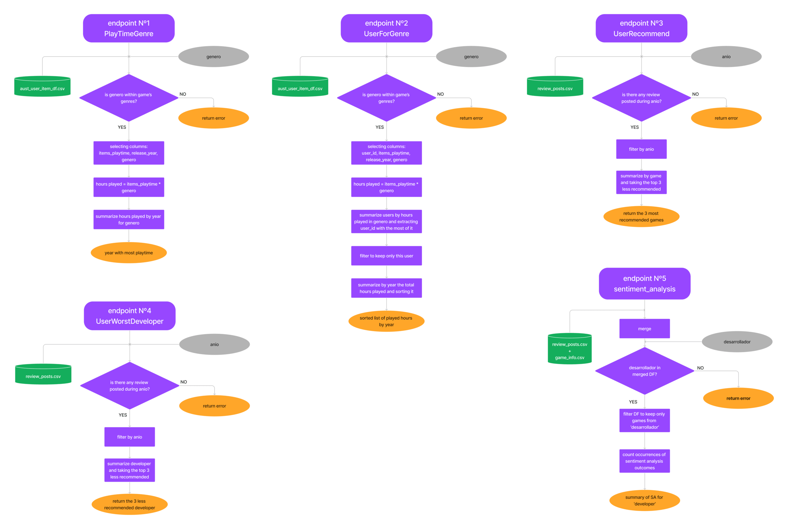
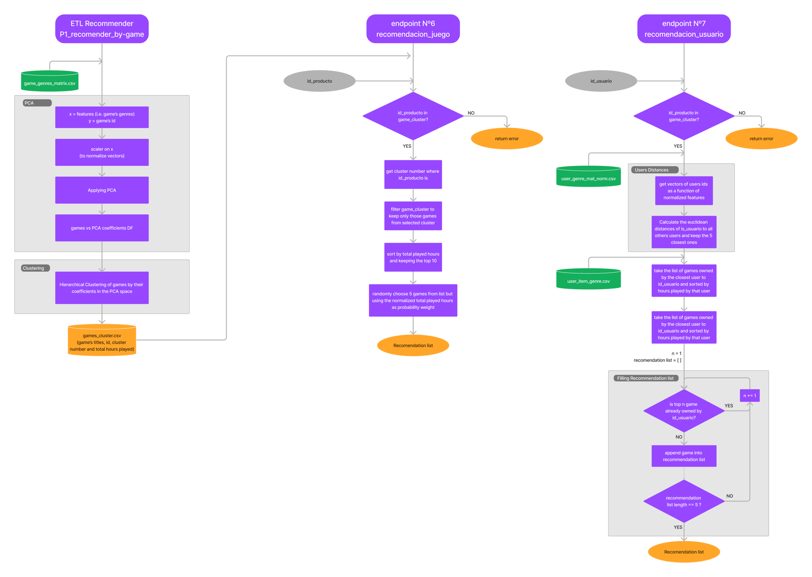

# Individual Project Nº1: ML-OPS

## Recommender System for games and users in Steam platform

### Resume:

This project aims to get a deployed API capable to perform several
predefined tasks taking data from the Australian users and games
databases of Steam gaming platform. Tasks performed by the API ranges
from queries to the databases to the recommendation of games to users
based in theirs profiles or the owning (or likening) of a particular
game.

Work can be separated in 3 major and topics:

1.  ETL process
2.  Machine Learning algorithm for recommender system
3.  API building

Next sections explains in more detail what has been done in each topic, the
decisions made and the outcomes.

### 1) ETL

ETL process is separated in several files for simplicity and getting a
smoother workflow, yet these files must be executed in an specific order
since the input of one can be the output of another. Details of the
workflow followed at this stage is schematized in Figure 1.

Figure 1: workflow for ETL process

#### I.  PI1_ETL_output_steam_source

    INPUT:

        - output_steam_games.json
          original file from Steam databases

    OUTPUTS:

        - game_genres_matrix.csv
        - game_info.csv
        - game_price.csv

*WORK*:

ETL process starts with the reading of the file with the Steam's games
info (output_steam_games.json), a table with 13 columns: publisher,
genres, app_name, title, url, release_date, tags, reviews_url, specs,
price, early_access, id, and developer.

Following next is dealing with NaNs present in all columns, for that:

-   all rows entirely made of NaNs were removed

-   there are 2049 rows with missing titles but only 1 with missing
    app_name, so they're imputed with the corresponding app_name

-   there are 8052 rows with missing publisher and 3299 with missing
    developers so they're cross-imputed when possible

-   Special care was taken for missing ids (2), one was an almost empty
    register but the other one was a current game which id was imputed
    by pinpointed that game (by name) in another of the given databases.

-   NaNs in genres were imputed with the info provided by tags column
    when possible but only those tags that already existed in genres
    column were used to fill the missing values.

Next is dealing with duplicates where all rows that are duplicated on
all column values were removed (leaving one of course), but a closer
examination of duplicated info in individual columns (e.g. title) leads
that is not a good idea to remove them since they all have different ids
that relates to different entries in others databases (e.g. a game could
have been sold to another developer whom revamped it and release it in
another year with the same title).

Following step is de-nesting the genre column and expanding it so each
individual genre has its own column with cell values filled with '1' or
'0' correspondingly to each game value in original nested genre column.
With this process, games with NaNs in original genre column now have a
row of zeros filling the specific genre columns. Lastly, 'year' and 'price'
columns were cleaned. NaNs at 'price' column were imputed with the median
while for NaNs in 'year' were randomly imputed one by one but with
choosing weights following the probability density function of game's
release year distribution.

#### II.  PI1_ETL_aus_users_items

    INPUTS:

        - australian_users_items8200.json

          a reduced version of australian_users_items.json original file
          from Steam databases with only 8200 users included in order
          to be able to build up all these ETL and ML codes with a regular
          computer. At the end, API is feeded with an even more
          reduced version (down to 500 users) in order to be able to
          run under the 512MB limit imposed by Render.

        - game_info.csv

        - game_genres_matrix.csv

    OUTPUTS:

        - user_item_genre.csv
        - aust_user_item_df.csv
        - user_genre_mat_norm.csv
        - users_genres_df.csv

*WORK*:

ETL process starts by reading a reduced version of the original Steam
file australian_users_items.json to account roughly 10% of its original
users (down to 8200 distinct users) in order to cope with limited RAM
and processor of a personal computer. This file has 5 columns: user_id,
items_count, steam_id, user_url, and items (double nested). Columns
'user_url' and 'steam_id' were dropped since they don't add useful
information for the current job. No NaNs were detected at this stage so
work continued to deal with duplicates where it was found that not a
single duplicate is coming from an users updated registers, so all
duplicates are dropped.

Following step is de-nest 'items' column in a way that each user now has
as many entries (rows) as games owns. Deeper nested info now show up as
nested column (also named 'items') which cells are dictionaries with the info of how
a particular user interacts with a particular game. This last nested
column is also de-nested but now each key:value pair goes to individual
new columns. NaNs showed up after this process but a closer look into
them leads that they're coming from users that doesn't have any game so
those registers are imputed accordingly.

Finally 2 users-genre matrix are created where each row is a user and
each column a genre, cell values are computed as how much this
particular user (row) has played a game with a particular genre (column)
association by using the following equation:

$$cell_{i,j} = a_{i,j} {\sum\limits_{k = 1}^{N}{(1 + {\alpha \ast PTF_{i,j,k}} + {\beta \ast PT2W_{i,j,k}})}}$$

where $a_{i,j}$ is '1' if user *i* has any game with genre *j* or '0' if otherwise,
 ${PTF}_{i,j,k}$ is *Playtime_forever*, ${PT2W}_{i,j,k}$ is *Playtime_2weeks*
values (accumulated hours played by user *i* on game *k* forever and over
the lapse of last 2 weeks, respectively) on games that belongs to genre
*j* and for each of the *N* games owned by user *i*, lastly, $\alpha$ and $\beta$ are 
weighting factors for lifetime and short term playing hours. A second matrix is
created with normalized values. These matrices represent the "likeness"
of each user for each game genre in a way of a 22-dimensional vector (since there are
22 game's genres or features).

**Discussion about users "likings" to game genres**

> A more conservative approach would have been to use a sentiment analysis
applied over the reviews made by users on games and propagate the result
over the game genres accordingly. But here, the amount of hours that a
user played a game that belongs to a specific genre seems to be more
adequate to reflect the user likings since no every user is prompt to
submit reviews (not to say to submit for all of his/her owned games) and
even so, there are some inherent issues within sentiment analysis procedures 
when trying to catch the real sentiment of game reviews as it is stated by the following
reference: Viggiato, Markos et al. "What Causes Wrong Sentiment
Classifications of Game Reviews?" IEEE Transactions on Games 14 (2022):
350-363 (for example, reviews in gaming community are prompt for heavy
use of sarcasm which greatly disguise their true meaning to sentiment
analysis automated algorithm). In the other hand, it seems unlikely that
someone can play a game that don't like for thousands of hours. Even more,
an exploratory analysis within provided Steam reviews database yielded on 85% of the
reviews recommends the game being under scrutiny and, additionally, reviews
that 'not recommend' the game perform positively to TF-IDF sentiment
analysis in a huge proportion.

#### III.  PI1_ETL_aus_users_revs

    INPUTS:

        - australian_user_reviews.json

          original Steam file with info of the reviews posted by users
          for any game

    OUTPUTS:

        - reviews_posts.csv

*WORK*:

ETL starts with reading the australian_user_reviews.json file from Steam
database, this file has 3 columns: user_id, user_url, reviews (double
nested). Firstly, rows with duplicated 'user_id' are dropped after
crosschecking that those duplicates aren't from updated reviews of
the same user (there are none of these cases).

Next, the 'reviews' column is de-nested in a way that each user now span
as much rows as games he/she reviewed and new columns were created, one
for each specific key of the review. One of them is date when reviews
has been posted, where year (specifically) is extracted to a new column. By doing so,
NaNs showed up but only at this newly created 'posted_year' column. An
exploratory analysis of the data showed that in those cases, month and
day were still present which implies that the review has been posted in the
same year that the database snapshot was taken (i.e. a review posted in
March 12, 2017 say precisely that but a review posted on March 12 of the
current year lacks of the year). Therefore, NaNs on 'posted_year' were
imputed with the greatest year existing in database plus 1.

*SENTIMENT ANALYSIS*:

Sentiment analysis were performed over the existing reviews by means of
NLTK library. Inside each review, the following procedure was performed:

1.  Transform to lower case
2.  remove punctuation marks with regex
3.  tokenize it
4.  remove stop words
5.  lemmatization
6.  get sentiment score (coumpound)
7.  characterize if sentiment is positive, negative or neutral

### 2) Machine Learning algorithm for recommender system

The core of this project is a recommendation system for Steam platform,
after having performed the ETL process now is time to build it. Two
different system are being proposed:

I.  Given a particular game, recommend others that are similar

II. Given a particular user, recommend him/her others games that match their interest.

This stage perform the core work of the recommendation systems by taking
the proper datasets from ETL and built others that will feed the API
corresponding endpoints.

#### I.  PI1_recommender_by_game:

    INPUT:

        - game_genre_matrix.csv

    OUTPUT:

        - game_cluster.csv

*WORK*:

General idea is to perform a clustering process of all games based on
theirs genres association. The game to recommend for a given one must be
of the same cluster ensuring, in this way, the similarity between both.

Game_genre_matrix is a table of game ids as a function of 22 predictors
(game's genres). Although it is already possible to perform the
clustering process with this table, it isn't efficient since some
predictors are likely related (or unrelated) to others (e.g. a game
associated to 'strategy' genre would also be likely associated to
'action', or a game associated to 'education' would be unlikely
associated to 'RPG' ) therefore a dimensionality reduction process could
be applied, particularly suited for this case is PCA since it will look
for new vectors that could represent game's genres as a linear
combination of the 22-fold original ones but with less dimension by
maximizing the explained variance.

Here, a PCA process has been applied to reduce feature's space from 22
dimension to 12 (with 12 components it is possible to explain around 75%
of the variance). As result, a matrix with games id as a
function of PCA components has been obtained. A Hierarchical Clustering process has been
performed on this new matrix with 10 final clusters and euclidean
affinity.

Finally, games ids are associated with theirs particular cluster numbers, the
calculation of how popular are (by means of total hours played), and a
dataset is exported.

#### II.  PI1_recommender_by_user

    INPUTS:

        - user_genre_mat_norm.csv
        - user_item_genre.csv

    OUTPUT: None

WORK:

Actually, the work implemented in this notebook is for testing
purposes only since its completely integrated within the API itself.

The general idea is that all users have a characteristic 'fingerprint'
on game's likings, therefore, if the distance between a given "user A"
with all others can be computed with some metric, the distance between
users can be related to how much those users overlap their likings in
gaming, and the closest one to 'user A' in distance must be the one user
('user B') that share the most. Then, recommendation would come from
games owned by 'user B' that aren't in the 'user A' profile sorted by a
given figure of merit.

Here, the users 'fingerprints' are their normalized coordinates in the
user -- genres matrix (user_genre_mat_norm.csv) which comprises how much
hours a user has played games in each genre. The distances between two
users is calculated by means of the euclidean distance since its better
suited for this implementation as users coordinates are actual numeric
values (i.e. not coming from text mining) and 'user B' is chosen as the
one with minimal distance to 'user A'. The amount of hours that 'user B'
has played each game yields the figure of merit used to sort his/her
game list. Recommended games comes from the top of this list, checking
that they aren't already at 'user A' game list.

### 3) API building

Proposed API have following 7 endpoints:

1.  PlayTimeGenre (*genero*:str)

    It must return the year that have the most hours played in a given
    game genre ('genero')

2.  UserForGenre (*genero*:str)

    It must return the user that have the most hours played in a given
    game genre ('genero') and a list of the accumulated hours played by
    that user per year.

3.  UserRecommend (*anio*:int)

    It must return the top 3 most recommended games by users in a given
    year ('anio')

4.  UsersWorstDeveloper (*anio*:int)

    It must return the top 3 developer companies that have the less
    recommended games by users in a given year.

5.  Sentiment_Analysis (*desarrollador*:str)

    Given the name of a developer company ('desarrollador'), it must
    return a dictionary with the name of the developer as a key and a
    list with the total amount of reviews entries categorized by a
    sentiment value (positive, neutral, negative)

6.  recomendacion_juego (*id_producto*:int)

    It must return a list of 5 recommended games that are similar to a
    given game id

7.  recomendacion_usuario (*id_usuario*:int)

    It must return a list of 5 recommended games for a given user id

Workflow in each endpoint is schematized in Figures 2 and 3

Figure 2: workflow of API endpoints 1 to 5.

Figure 2: workflow of API endpoints 6 and 7, and its ETL process.
